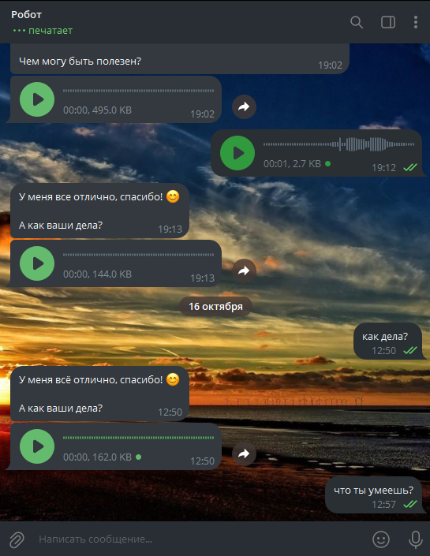

# Telegram Speech-to-Text Text-to-Speech Bot

Telegram бот с поддержкой голосового и текстового общения, использующий технологии распознавания и синтеза речи  
Позволяет отправлять сообщения голосом или текстом и получать ответы в обоих форматах  

В Google Colab <a href="https://colab.research.google.com/drive/1Dj-EkjfXAiQpdRWiYGAVXvGXGWIBuBIs"></a> ноутбуке находится код приложения с комментариями, демонстрация пошагового инференса моделей для генерации текста, преобразования текста в речь (TTS) и распознавания речи (STT)


## 📋 Содержание

- 🚀 [Функционал](#-Функционал)
- 🏗 [Стек технологий](#-Стек-технологий)
- 📁 [Структура проекта](#-Структура-проекта)
- 🐳 [Запуск через Docker Compose](#-Запуск-через-Docker-Compose)
- 🐍 [Установка и запуск через Python](#-Установка-и-запуск-через-Python)
- 🛠 [Настройка](#-Настройка)


## 🚀 Функционал

- Настройка режима ответа - отвечать текстом или/и голосом (настройка в inline кнопках бота)
- Настройка параметров генерации [`temperature`, `top_k`, `top_p`, `repetition_penalty`] (настройка в inline кнопках бота)
- Включение/отключение режима размышлений LLM (настройка в inline кнопках бота)
- Включение/отключение вывода размышлений в ответе бота (настройка в inline кнопках бота)
- Включение/отключение стриминга сообщений - бот будет возвращать токены по мере генерации ответа, как в LLM интерфейсах (настройка в inline кнопках бота)
- Выбор голоса из 5 доступных (настройка в inline кнопках бота)
- Выбор LLM модели в формате GGUF (настройка перед запуском бота в файле `config/config.py`)
- Возможность выбора любого токенайзера из HF или же встроенного в GGUF

<details>
<summary><b>Скриншот Telegram бота</b></summary>


</details>


## 🏗 Стек технологий

**Стек технологий**
- [python](https://www.python.org/) >= 3.10
- [aiogram](https://github.com/aiogram/aiogram) для написания Telegram бота
- [llama-cpp-python](https://github.com/abetlen/llama-cpp-python) для инференса LLM моделей в формате GGUF
- [vosk-api](https://github.com/alphacep/vosk-api) для распознавания речи (STT)
- [vosk-tts](https://github.com/alphacep/vosk-tts) для синтеза речи (TTS)
- [Модель gemma-3-1b](https://huggingface.co/bartowski/google_gemma-3-1b-it-GGUF) `google_gemma-3-1b-it-Q8_0.gguf` в формате GGUF в качестве LLM модели по умолчанию
- [ffmpeg](https://ffmpeg.org/) для конвертации голосовых сообщений из формата `.ogg` в формат `wave`
- [chatgpt-md-converter](https://github.com/Latand/formatter-chatgpt-telegram) для преобразования ответов LLM из формата Markdown в формат HTML, совместимый с Telegram bot API

Работоспособность проекта проверялась на Ubuntu 22.04 (python 3.12) и Windows 10 (python 3.12)  


## 📁 Структура проекта

<details>
<summary><b>Структура проекта</b></summary>

```
📁 telegram-stt-tts-bot/
├── 📁 bot/
│   ├── 📁 filters/              - фильтры
│   │   └── filters.py           - все фильтры в одном модуле
│   ├── 📁 init/                 - инициализация всех объектов для работы программы
│   │   ├── bot.py               - бот, диспетчер, подключение роутеров и мидлварей
│   │   ├── db.py                - БД
│   │   ├── worker_models.py     - модели для запуска в пуле процессов
│   │   └── queue.py             - очередь обработки запросов юзеров
│   ├── 📁 kb_parameters/        - динамические inline кнопки с калбэками
│   │   ├── base.py              - базовые классы динамических кнопок
│   │   ├── classes.py           - основные классы динамических кнопок
│   │   └── kb_parameters.py     - инициализация конкретных наборов кнопок
│   ├── 📁 keyboards/            - клавивиатуры
│   │   └── keyboards.py         - все клавиатуры в одном модуле
│   ├── 📁 middlewares/          - мидлвари для проброса переменных в хэндлеры
│   │   ├── db.py                - проброс БД
│   │   └── lang.py              - проброс класса с текстами на языке юзера
│   ├── 📁 routers/              - роутеры
│   │   ├── commands.py          - обработка команд которые юзер присылает боту
│   │   ├── lang.py              - выбор языка
│   │   ├── speech_to_speech.py  - основной папйплан ответа юзеру
│   │   ├── start.py             - команда старт и кнопка возврата в главное меню
│   │   ├── user_settings.py     - настроки конфига юзера
│   │   └── voice.py             - смена голоса
│   ├── 📁 services/             - дополнительные сервисы
│   │   ├── executor_handlers.py - функции для вызова в пуле процессов, основная функция ответа юзеру
│   │   ├── executor_wrappers.py - обертки над классами TextPipeline и SpeechPipeline для использования в пуле процессов
│   │   ├── llm.py               - класс TextPipeline для генерации ответа LLM
│   │   └── speech.py            - класс SpeechPipeline для TTS и STT
│   ├── 📁 states/               - состояния
│   │   └── states.py            - все состояния в одном модуле
│   ├── 📁 texts/                - тексты на разных языках с каллюбками для кнопок
|   |   ├── 📁 locales           - классы с текстами для разных языков
│   │   |   |── ru.py
│   │   |   └── en.py
│   │   ├── base_enums.py        - базовые классы enums
│   │   ├── lang_enum.py         - enum для выбора языка
│   │   ├── languages.py         - загрузка классов с текстами из модулей директории locales
│   │   └── localization.py      - выбор конкретного класса текста для выбранного языка
│   ├── 📁 utils/                - вспомогательные утилиты
│   │   ├── commands.py          - парсер команд которые юзер присылает боту
│   │   ├── downloader.py        - загрузчик файлов моделей TTS и STT
│   │   ├── logger.py            - функция конфигурации логирования
│   │   └── queue.py             - класс очереди с мультимпроцессингом и семафором
├── 📁 config/                   - конфиги
│   |── config.py                - основной конфиг с настройками моделей
│   |── logger.py                - конфиг логгирования
│   |── queue.py                 - настройки очереди
│   └── user.py                  - конфиг юзера с настройками по умолчанию
├── 📁 data/                     - модели, БД
│   |── 📁 bot_db                - директория для БД
|   |    └── users.db            - БД с настройками юзеров
│   |── 📁 llm_model             - модель и токенайзер
|   |    ├── 📁 tokenizer_folder - директория токенайзера с HF
|   |    └── model_name.gguf     - модель в формате GGUF 
│   └── 📁 speech_models         - модели для распознавания и синтеза речи
|        ├── 📁 vosk_stt         - модель для распознвавания речи (STT)
|        └── 📁 vosk_tts         - модель для синтеза речи (TTS)
├── 📁 docker/                   - Dockerfile и Docker-Compose
│   |── compose.base.yml         - compose с общими настройками для всех остальных compose
│   |── compose.build.cpu.yml    - compose для сборки и запуска программы на CPU
│   |── compose.build.cuda.yml   - compose для сборки и запуска программы на CUDA
│   |── compose.run.cpu.yml      - compose для запуска программы на CPU из готового образа
│   |── compose.run.cuda.yml     - compose для запуска программы на CUDA из готового образа
│   |── Dockerfile-cpu           - Dockerfile для сборки образа для CPU
│   └── Dockerfile-cuda          - Dockerfile для сборки образа с поддержкой CUDA
├── 📁 requirements/             - библиотеки для работы программы и их версии
│   |── base.txt                 - базовые библиотеки
│   |── cpu.txt                  - библотеки для инференса моделей на CPU + базовые
│   |── cuda.txt                 - библотеки для инференса моделей на CUDA + базовые
│   └── test.txt                 - библиотеки для тестирования + cpu
│── 📁 tests/                    - тесты
│    └── test_simple.py          - простой тест запуска бота и отправки сообщения юзеру
├── .env                         - файл с токеном бота которыый нужно обязательно создать перед запуском
├── .env.example                 - пример файла `.env` с токеном бота
├── README.md                    - описание проекта
└── main.py                      - главный файл запуска бота
```
</details>

## 🐳 Запуск через Docker Compose

**1) Клонирование репозитория**  
```sh
git clone https://github.com/sergey21000/telegram-stt-tts-bot.git
cd telegram-stt-tts-bot
```

**2) Установка токена бота**

Создать файл `.env` в директории `telegram-stt-tts-bot`, чтобы в переменной `BOT_TOKEN` находился токен Telegram бота, полученный у https://t.me/BotFather  
Пример файла `.env`
```env
BOT_TOKEN=0123456789:AAF3EvtzIxx7qOPgv725tFRKZZTLaAJ3xX4
```

**3) Запуск Compose из готового образа**

*Запуск с поддержкой CPU*
```sh
docker-compose -f docker/compose.run.cpu.yml up
```

*Запуск с поддержкой CUDA*
```sh
docker-compose -f docker/compose.run.cuda.yml up
```

**3) Запуск Compose со сборкой образа**

*Запуск с поддержкой CPU*
```sh
docker-compose -f docker/compose.run.cpu.yml up
```

*Запуск с поддержкой CUDA*
```sh
docker-compose -f docker/compose.run.cuda.yml up
```
При первом запуске будет произведена сборка образа на основе `Dockerfile-cpu` или `Dockerfile-cuda`

---
<ins><b>Дополнительно</b></ins>

Можно заранее указать файл `compose` по умолчанию и запускать короткой командой
```sh
# установка переменной окружения (вариант для Linux)
export COMPOSE_FILE=docker/compose.run.cpu.yml

# установка переменной окружения (вариант для Windows PowerShell)
$env:COMPOSE_FILE="docker/compose.run.cpu.yml"

# запуск короткой командой
docker-compose up
```


## 🐍 Установка и запуск через Python

**1) Установка `ffmpeg`**

 - *Linux*
  ```sh
  sudo apt install ffmpeg
  ```
 - *Windows*
  ```ps1
  winget install ffmpeg
  ```

**2) Клонирование репозитория**  

```sh
git clone https://github.com/sergey21000/telegram-stt-tts-bot.git
cd telegram-stt-tts-bot
```

**3) Создание и активация виртуального окружения (опционально)**

<ins><b>Через Pip</b></ins>

- *Linux*
  ```sh
  python3 -m venv .venv
  source .venv/bin/activate
  ```

- *Windows PowerShell*
  ```ps1
  python -m venv .venv
  .venv\Scripts\activate.ps1
  ```

<ins><b>Через [UV](https://docs.astral.sh/uv/getting-started/installation/)</b></ins>

*Опициональная установка конкретной версии Python*
```
uv python install 3.12
```

*Linux/Windows*
```sh
uv venv
```

**4) Установка зависимостей**  

<ins><b>Через Pip</b></ins>

- *С поддержкой CPU*
  ```sh
  pip install -r requirements/cpu.txt
  ```

- *С поддержкой CUDA 12.4 (Linux)*
  ```sh
  pip install -r requirements/cuda.txt
  ```

- *С поддержкой CUDA 12.4 (Windows, Python 3.12)*
  ```ps1
  pip install -r requirements/win-3.12-cuda.txt
  ```

<ins><b>Через [UV](https://docs.astral.sh/uv/getting-started/installation/)</b></ins>

- *С поддержкой CPU*
  ```sh
  uv pip install -r requirements/cpu.txt
  ```

- *С поддержкой CUDA 12.4 (Linux)*
  ```sh
  uv pip install -r requirements/cuda.txt
  ```

- *С поддержкой CUDA 12.4 (Windows, Python 3.12)*
  ```ps1
  uv pip install -r requirements/win-3.12-cuda.txt
  ```

Для других версий и систем [собрать llama-cpp-python](https://github.com/abetlen/llama-cpp-python?tab=readme-ov-file#installation) из исходников  

> [!NOTE]  
> Для сборки `llama-cpp-python` из исходников на Windows с поддержкой CUDA нужно предварительно установить [Visual Studio 2022 Community](https://visualstudio.microsoft.com/ru/downloads/) и [CUDA Toolkit](https://developer.nvidia.com/cuda-toolkit-archive), как например указано в этой [инструкции](https://github.com/abetlen/llama-cpp-python/discussions/871#discussion-5812096)  
В случае ошибки при установке `llama-cpp-python` воспользоваться поиском по [issue](https://github.com/abetlen/llama-cpp-python/issues), например [issues/1963](https://github.com/abetlen/llama-cpp-python/issues/1963) с командой установки `llama-cpp-python` на Windows 11  
[Инструкции](https://github.com/abetlen/llama-cpp-python?tab=readme-ov-file#installation-configuration) по установке `llama-cpp-python` для других версий и систем

**5) Установка токена бота**

Установить в переменую `BOT_TOKEN` в файле `.env` токен бота, полученный у https://t.me/BotFather
```env
BOT_TOKEN=your_token
```
Опционально - выбрать модель в файле `config/config.py`  

**6) Запуск бота**  

```sh
python app.py
```

При первом запуске произойдет загрузка следующих моделей:
- модель LLM по умолчанию ([gemma-3-1b](https://huggingface.co/bartowski/google_gemma-3-1b-it-GGUF), 2.7 GB) в папку `data/llm_model`
- модель для распознавания речи ([vvosk-model-small-ru-0.22.zip](https://alphacephei.com/vosk/models/vosk-model-small-ru-0.22.zip), 44.1 Mb), архив с папкой модели будет распакован в папку `speech_models/vosk-model-small-ru-0.22`
- модель для синтеза речи ([vosk-model-tts-ru-0.7-multi.zip](https://alphacephei.com/vosk/models/vosk-model-tts-ru-0.7-multi.zip), 129 Mb), архив с папкой модели будет распакован в папку `speech_models/vosk-model-tts-ru-0.9-multi`

**Запуск тестов**
```sh
pytest -vs .\tests\test_speech_to_speech.py
```


## 🛠 Настройка

**Настройка конфига перед запуском бота**

Для настройки бота перед запуском отредактировать файл `config/config.py`

**1)** Для выбора LLM модели и настроек параметров запуска редактировать словарь `LLAMA_MODEL_KWARGS`  
Для выбора LLM модели указать по ключу `repo_id=` название репозитория на HuggingFace, по ключу `filename=` указать название файла в формате GGUF из репозитория  
Можно изменить или добавить прочие [параметры инициализации](https://llama-cpp-python.readthedocs.io/en/latest/api-reference/#llama_cpp.Llama.__init__) модели

Где искать LLM модели в формате GGUF
- [bartowski](https://huggingface.co/bartowski) 
- [mradermacher](https://huggingface.co/mradermacher) 
- [поиск на HuggingFace](https://huggingface.co/models?pipeline_tag=text-generation&library=gguf&sort=trending)

**2)** Смена моделей для распознавания и синтеза речи - указать в `config/config.py` в переменной `TTS_MODEL_URL` ссылку на TTS модель, в переменую `MODEL_URL_STT` ссылку на STT модель  
Например можно установить модель TTS версии 0.9 - у нее качество получше но весит больше (746 Mb против 129 Mb в версии 0.7)
```python
TTS_MODEL_URL='https://alphacephei.com/vosk/models/vosk-model-tts-ru-0.9-multi.zip'
```
[Список всех моделей Vosk](https://alphacephei.com/vosk/models/model-list.json) - искать TTS модели можно по поиску `tts`  
[Список STT моделей](https://alphacephei.com/vosk/models) - в конце есть список репозиториев где можно найти другие совместимые модели

*Модели TTS есть только для русского в библиотеке vosk-tts*  
https://github.com/alphacep/vosk-tts/issues/19

**3)** Добавление локализации для бота - создать копию файла `bot/texts/locales/en.py`, переименовать ее в нужный код языка и заменить все строковые переменные на их переведенные версии

**4)** Настройка очереди и параллелизма - в конфиге `config/queue.py` можно установить кол-во одновременно обрабатываемых запросов в переменной `MAX_CONCURRENT_QUEUE_TASKS`

**5)** Установка токенайзера - записать ID репозитория токенайзера из HF в конфиг `config/config.py` в переменную `TOKENIZER_REPO_ID`  
Если установить в `TOKENIZER_REPO_ID` пустую строку или None и если переменная `USE_HF_TOKENIZER=True` то будет произведена попытка распарсить ID репозитория токенайзера из `LLAMA_MODEL_KWARGS['repo_id']`  
Чтобы использовать встроенный в модель GGUF токенайзер вместо HF - установить `USE_HF_TOKENIZER=False`

**6)** Установить ID чата админа в `config/config.py` в переменную `ADMIN_CHAT_ID` чтобы получать сообщения об ошибках вызова главной функции и чтобы работала команда /getid, которая присылает админу ID текущего чата

---
**Настройки которые задаются через `inline` кнопки бота**

**1)** Изменить [параметры генерации](https://llama-cpp-python.readthedocs.io/en/latest/api-reference/#llama_cpp.Llama.create_chat_completion) ответа можно в интерфейсе бота через `inline` кнопки, или через команды `/set`, `/reset` (вызов справки по команде `/help`)

**2)** Режим размышлений включается/отключается кнопокй `ebable_thinking` - работает только если `USE_HF_TOKENIZER=True` в конфиге `config/config.py`, если `USE_HF_TOKENIZER=False` то режим размышлений включен всегда если модель его поддерживает  
Параметр `show_thinking` - выводить или не выводить то о чем размышляла модель  

---
<ins><b>Вывод команды /help</b></ins>

<b>Установка параметров:</b>  
/set <code>название_параметра число</code>  
<b>Пример:</b>  
/set <code>temperature 0.5</code> - установить температуру на 0.5  
/set <code>enable_thinking 1</code> - включить режим размышлений  

<b>Сброс параметров:</b>  
/reset <code>название_параметра</code>  
<b>Пример:</b>  
/reset <code>temperature</code> - сбросить температуру на значение по умолчанию  

<b>Описание параметров генерации:</b>  
<code>temperature</code>, <code>top_p</code>, <code>top_k</code>, <code>repeat_penalty</code>, <code>max_tokens</code> - параметры генерации llama-cpp-python  
<code>enable_thinking</code> - включение/отключение режима размышлений (если Config.USE_HF_TOKENIZER=False то всегда вкл)  
<code>show_thinking</code> - выводить размышления в ответе  
<code>stream_llm_response</code> - выводить ответ бота частями (работает только если активен answer_with_text)  
<code>system_prompt</code> - ввести новый системный промт  
<code>user_lang</code> - смена языка  
<code>voice_name</code> - выбор голоса  
<code>answer_with_text</code> - отвечать текстовыми сообщениями (должен быть включен или хотя бы один или оба параметра)  
<code>answer_with_voice</code> - отвечать голосовыми сообщениями (должен быть включен или хотя бы один или оба параметра)  


---
Приложение написано для демонстрационных и образовательных целей и не предназначалось / не тестировалось для промышленного использования


## Лицензия

Этот проект лицензирован на условиях лицензии [MIT](./LICENSE).
