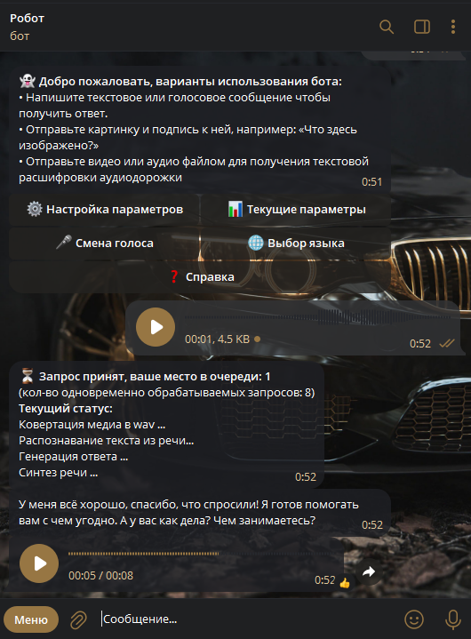
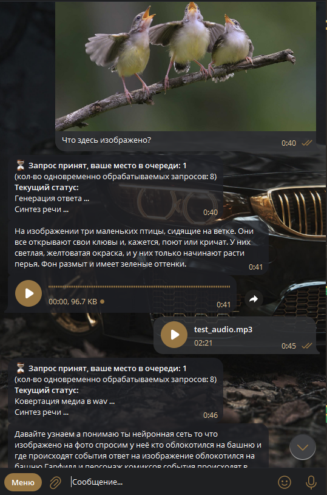

# Telegram Speech-to-Text Text-to-Speech Bot

Telegram бот с поддержкой голосового и текстового общения, использующий технологии распознавания и синтеза речи  
Позволяет отправлять сообщения голосом/текстом/(текстом + изображением) и получать ответы в обоих форматах  

В Google Colab <a href="https://colab.research.google.com/drive/1Dj-EkjfXAiQpdRWiYGAVXvGXGWIBuBIs"></a> ноутбуке находится код приложения с комментариями, демонстрация пошагового инференса моделей для генерации текста, преобразования текста в речь (TTS) и распознавания речи (STT)


## 📋 Содержание

- 🚀 [Функционал](#-функционал)
- 🏗 [Стек технологий](#-стек-технологий)
- 🐍 [Установка и запуск через Python](#-установка-и-запуск-через-Python)
- 🛠 [Настройка](#-настройка)
- 🐳 [Запуск через Docker Compose](#-запуск-через-Docker-Compose)
- 📁 [Структура проекта](#-структура-проекта)


## 🚀 Функционал

- Мультимодальный input - возможность принимать текст, текст + изображение или голосовое сообщение
- При отправке боту аудио или видео файлом он возвращает текстовую расшифровку
- Настройка режима ответа - отвечать текстом или/и голосом (настройка в inline кнопках бота)
- Настройка параметров генерации [`temperature`, `top_k`, `top_p`, `repetition_penalty`, `max_tokens`] (настройка в inline кнопках бота)
- Включение/отключение режима размышлений LLM (настройка в inline кнопках бота)
- Включение/отключение вывода размышлений в ответе бота (настройка в inline кнопках бота)
- Включение/отключение стриминга сообщений - бот будет возвращать токены по мере генерации ответа, как в LLM интерфейсах (настройка в inline кнопках бота)
- Выбор голоса из 14 доступных (настройка в inline кнопках бота)
- Выбор LLM модели в формате GGUF (настройка перед запуском бота в файле `.env`)
- Поддержка внешнего OpenAI-compatible сервера (переменная окружения `OPENAI_BASE_URL`)


<details>
<summary><b>Скриншот команды /start и голосового общения</b></summary>


</details>

<details>
<summary><b>Скриншот подачи на вход изображения и аудио</b></summary>


</details>


<details>
<summary><b>Скриншот настроек юзера</b></summary>


</details>


## 🏗 Стек технологий

**Стек технологий**
- [python](https://www.python.org/) >= 3.10
- [aiogram](https://github.com/aiogram/aiogram) асинхронная библиотека для написания Telegram ботов
- [llama-cpp-py](https://github.com/sergey21000/llama-cpp-py) python обертка для запуска [llama.cpp](https://github.com/ggml-org/llama.cpp) сервера (локальные LLM модели в формате GGUF)
- [SpeechRecognition](https://github.com/Uberi/speech_recognition) для распознавания речи (STT) (онлайн сервис)
- [edge-tts](https://github.com/rany2/edge-tts) для синтеза речи (TTS) (онлайн сервис)
- [ffmpeg](https://ffmpeg.org/) для конвертации видео и аудио в формат `wav`
- [chatgpt-md-converter](https://github.com/Latand/formatter-chatgpt-telegram) для преобразования ответов LLM из Markdown в формат HTML, совместимый с Telegram bot API
- [aiosqlite](https://github.com/omnilib/aiosqlite) - база данных для хранения настроек пользователей
- [python-dotenv](https://github.com/theskumar/python-dotenv) - переменные окружения
- [Pillow](https://github.com/python-pillow/Pillow) - resize изображения перед подачей в мультимодальную модель
- [Модель gemma-3-4b](https://huggingface.co/bartowski/google_gemma-3-4b-it-GGUF) в формате GGUF в качестве VLM модели по умолчанию  
(файлы `google_gemma-3-4b-it-Q8_0.gguf` и `mmproj-google_gemma-3-4b-it-f16.gguf`)


## 🐍 Установка и запуск через Python

<ins><b>1) Установка `ffmpeg`</b></ins>

 - *Linux*
  ```sh
  sudo apt install ffmpeg
  ```
 - *Windows*
  ```ps1
  winget install ffmpeg
  ```

<ins><b>2) Клонирование репозитория</b></ins>
```ps1
git clone https://github.com/sergey21000/telegram-stt-tts-bot.git
cd telegram-stt-tts-bot
```

<ins><b>3) Создание и активация виртуального окружения (опционально)</b></ins>

**Через Pip**

- *Linux*
  ```sh
  python3 -m venv .venv
  source .venv/bin/activate
  ```

- *Windows PowerShell*
  ```ps1
  python -m venv .venv
  .venv\Scripts\activate.ps1
  ```

**Через [UV](https://docs.astral.sh/uv/getting-started/installation/)**

*Linux/Windows*
```ps1
uv venv
```

<ins><b>4) Установка зависимостей</b></ins>

**Через Pip**
```ps1
pip install -r requirements.txt
```

**Через [UV](https://docs.astral.sh/uv/getting-started/installation/)**
```ps1
uv pip install -r requirements.txt
```

<ins><b>5) Установка токена бота и модели LLM / VLM</b></ins>

Установить в переменую `BOT_TOKEN` в файле `.env` токен бота, полученный у https://t.me/BotFather
```env
BOT_TOKEN=your_token
```
Установить модель для llama.cpp можно в файле `.env.llamacpp`  
(по умолчанию установлена VLM [bartowski/google_gemma-3-4b-it-GGUF](https://huggingface.co/bartowski/google_gemma-3-4b-it-GGUF))

Выбрать девайс можно в переменной `LLAMACPP_PREFER_CUDA_BUILD`  
(`True` для CUDA и `False` для CPU) в `config/config.py'

Подробная настройка описана в разделе [Настройка](#-настройка)

<ins><b>6) Запуск бота</b></ins>

**Через Python**
```ps1
python main.py
```

**Через [UV](https://docs.astral.sh/uv/getting-started/installation/)**
```ps1
uv run main.py
```

После запуска дополнительно будет доступен web-интерфейс llama.cpp по адресу  
http://127.0.0.1:8081/

При первом запуске произойдет загрузка LLM / VLM моделей, установленных в файле `env.llamacpp` по умолчанию, поэтому
бот будет доступен не сразу

---
<ins><b>Запуск тестов</b></ins>

**Через Python**
```ps1
pytest -vs
```

**Через [UV](https://docs.astral.sh/uv/getting-started/installation/)**
```ps1
uv run python -m pytest -vs
```


## 🛠 Настройка

Настройки бота перед запуском находятся в файлах `config/config.py` (далее - конфиг) и `env.llamacpp`

---
**Настройка llama.cpp**

Переменные окружения llama.cpp  
https://github.com/ggml-org/llama.cpp/blob/master/tools/server/README.md

Для llama.cpp перед запуском выбрать модель можно несколькими вариантами аргументов
- агрументы `LLAMA_ARG_HF_REPO` и `LLAMA_ARG_HF_FILE`
- агрумент `LLAMA_ARG_MODEL` (путь до локальной модели в формате `GGUF`)
- агрумент `LLAMA_ARG_MODEL_URL` (ссылка на модель в формате `GGUF`)
- для мультимодальных моделей в дополнение к основному файл модели указать:
  - агрумент `LLAMA_ARG_MMPROJ` (путь до локальной модели в формате `GGUF`)
  - агрумент `LLAMA_ARG_MMPROJ_URL` (ссылка на модель в формате `GGUF`)

Модели хранятся в директории `./data/llm_model`, заранее скачанная модель для аргумента `LLAMA_ARG_MODEL_URL` должна быть в формате  
`репозиторий_файл.gguf`, например  
`bartowski_Qwen_Qwen3-0.6B-GGUF_Qwen_Qwen3-0.6B-Q4_K_M.gguf` или
`bartowski_google_gemma-3-4b-it-GGUF_google_gemma-3-4b-it-Q4_K_M.gguf`  
(резделитель `репозиторий_файл` стоит после GGUF)

Где искать LLM модели в формате GGUF
- [bartowski](https://huggingface.co/bartowski) 
- [mradermacher](https://huggingface.co/mradermacher) 
- [Поиск на HuggingFace](https://huggingface.co/models?pipeline_tag=text-generation&library=gguf&sort=trending)


По умолчанию в `env.llamacpp` установлена модель [bartowski/google_gemma-3-4b-it-GGUF](https://huggingface.co/bartowski/google_gemma-3-4b-it-GGUF) - при первом запуске бота будут загружены файлы `google_gemma-3-4b-it-Q8_0.gguf` (2.49 GB) и `mmproj-google_gemma-3-4b-it-f16.gguf` (851 MB)  в директорию `data/llm_model`


Загрузка релиза llama.cpp происходит автоматически, скачивается архив с учетом текущей ОС и аргумента конфига
`LLAMACPP_PREFER_CUDA_BUILD` (`True` для CUDA и `False` для CPU, можно установить через переменную окружения или непостредственно в конфиге)  

Для Linux нет скомпилированного билда llama.cpp, поэтому нужно его установить заранее и при запуске указать
```python
llama_server = LlamaAsyncServer(
    verbose=True,
    llama_dir=YOUR_LLAMA_CPP_BUILD_DIR,
)
```

Инструкции по сборке llama.cpp  
https://github.com/ggml-org/llama.cpp/blob/master/docs/build.md

Если требуется можно изменить код инициализации класса `LlamaAsyncServer` в `bot/init/models.py`

Можно вручную установить ссылку на конкретный [релиз llama.cpp](https://github.com/ggml-org/llama.cpp/releases)
```python
llama_server = LlamaAsyncServer(
    verbose=True,
    release_manager=LlamaReleaseManager(
        tag=Config.LLAMACPP_RELEASE_TAG,
        priority_patterns=priority_patterns,
		release_zip_url='https://github.com/ggml-org/llama.cpp/releases/download/b7315/llama-b7315-bin-win-cuda-13.1-x64.zip',
    ),
)
```

---
**Дополнительные настройки**

**1)** Установить ID чата админа в `config/config.py` в переменную `ADMIN_CHAT_ID` чтобы получать сообщения об ошибках вызова главной функции и чтобы работала команда /getid, которая присылает админу ID текущего чата

**2)** Настройка очереди и параллелизма - в конфиге `config/queue.py` можно установить максимальный размер очереди и максимальное кол-во одновременно обрабатываемых запросов в переменной `N_MAX_CONCURRENT_TASKS_IN_QUEUE`

**3)** Добавление локализации для бота - создать копию файла `bot/texts/locales/en.py`, переименовать ее в нужный код языка и заменить все строковые переменные на их переведенные версии

---
**Настройки которые задаются через `inline` кнопки бота**

**1)** Изменить [параметры генерации](https://llama-cpp-python.readthedocs.io/en/latest/api-reference/#llama_cpp.Llama.create_chat_completion) ответа можно в интерфейсе бота через `inline` кнопки, или через команды `/set`, `/reset` (вызов справки по команде `/help`)

**2)** Режим размышлений включается/отключается кнопокй `ebable_thinking`  
Параметр `show_thinking` - выводить или не выводить то о чем размышляла модель  

---
<ins><b>Вывод команды /help</b></ins>

<b>Установка параметров:</b>  
/set <code>название_параметра число</code>  
<b>Пример:</b>  
/set <code>temperature 0.5</code> - установить температуру на 0.5  
/set <code>enable_thinking 1</code> - включить режим размышлений  

<b>Сброс параметров:</b>  
/reset <code>название_параметра</code>  
<b>Пример:</b>  
/reset <code>temperature</code> - сбросить температуру на значение по умолчанию  

<b>Описание параметров генерации:</b>  
<code>temperature</code>, <code>top_p</code>, <code>top_k</code>, <code>repeat_penalty</code>, <code>max_tokens</code> - параметры генерации llama-cpp-python  
<code>enable_thinking</code> - включение/отключение режима размышлений  
<code>show_thinking</code> - выводить размышления в ответе  
<code>stream_llm_response</code> - выводить ответ бота частями (работает только если активен answer_with_text)  
<code>system_prompt</code> - ввести новый системный промт  
<code>user_lang</code> - смена языка  
<code>voice_name</code> - выбор голоса  
<code>answer_with_text</code> - отвечать текстовыми сообщениями (должен быть включен или хотя бы один или оба параметра)  
<code>answer_with_voice</code> - отвечать голосовыми сообщениями (должен быть включен или хотя бы один или оба параметра)  


## 🐳 Запуск через Docker Compose

**1) Клонирование репозитория**  
```sh
git clone https://github.com/sergey21000/telegram-stt-tts-bot.git
cd telegram-stt-tts-bot
```

**2) Установка токена бота и модели LLM / VLM**

Создать файл `.env` в директории `telegram-stt-tts-bot`, чтобы в переменной `BOT_TOKEN` находился токен Telegram бота, полученный у https://t.me/BotFather  
Пример файла `.env`
```env
BOT_TOKEN=0123456789:AAF3EvtzIxx7qOPgv725tFRKZZTLaAJ3xX4
```

**3) Запуск Compose из готового образа**

*Запуск с поддержкой CPU*
```sh
docker-compose -f docker/compose.yml up
```

*Запуск с поддержкой CUDA*
```sh
docker-compose -f docker/compose.cuda.yml up
```

**3) Запуск Compose со сборкой образа**

*Запуск с поддержкой CPU*
```sh
docker-compose -f docker/compose.build.cpu.yml up
```

*Запуск с поддержкой CUDA*
```sh
docker-compose -f docker/compose.build.cuda.yml up
```
При первом запуске будет произведена сборка образа на основе `Dockerfile`

---
<ins><b>Дополнительно</b></ins>

Можно заранее указать файл `compose` по умолчанию и запускать короткой командой
```sh
# установка переменной окружения (вариант для Linux)
export COMPOSE_FILE=docker/compose.cuda.yml

# установка переменной окружения (вариант для Windows PowerShell)
$env:COMPOSE_FILE="docker/compose.cuda.yml"

# запуск короткой командой
docker-compose up
```


## 📁 Структура проекта

<details>
<summary><b>Структура проекта</b></summary>

```
📁 telegram-stt-tts-bot/
├── 📁 bot/
│   ├── 📁 filters/              - фильтры
│   │   └── filters.py           - все фильтры в одном модуле
│   ├── 📁 init/                 - инициализация всех объектов для работы программы
│   │   ├── bot.py               - бот, диспетчер, подключение роутеров и мидлварей
│   │   ├── db.py                - БД
│   │   ├── kb.py                - инициализация динамических inline клавиатур
│   │   ├── models.py            - модель для STT, сервер и клиент для llama.cpp
│   │   └── queue.py             - очередь обработки запросов юзеров
│   ├── 📁 kb_parameters/        - динамические inline клавиатуры с калбэками
│   │   ├── base.py              - базовые классы динамических кнопок
│   │   ├── classes.py           - основные классы динамических кнопок
│   ├── 📁 keyboards/            - клавивиатуры
│   │   └── keyboards.py         - все клавиатуры в одном модуле
│   ├── 📁 middlewares/          - мидлвари для проброса переменных в хэндлеры
│   │   ├── db.py                - проброс БД
│   │   └── lang.py              - проброс класса с текстами на языке юзера
│   ├── 📁 routers/              - роутеры
│   │   ├── commands.py          - обработка команд которые юзер присылает боту
│   │   ├── lang.py              - выбор языка
│   │   ├── speech_to_speech.py  - основной папйплан ответа юзеру
│   │   ├── start.py             - команда старт и кнопка возврата в главное меню
│   │   ├── user_settings.py     - настроки конфига юзера
│   │   └── voice.py             - смена голоса
│   ├── 📁 services/             - дополнительные сервисы
│   │   ├── message_handler.py   - главная функция пайплайна STT -> TTS
│   │   ├── text.py              - класс TextPipeline для обработки текстов
│   │   └── speech.py            - класс SpeechPipeline для TTS и STT
│   ├── 📁 states/               - состояния
│   │   └── states.py            - все состояния в одном модуле
│   ├── 📁 texts/                - тексты на разных языках с каллюбками для кнопок
|   |   ├── 📁 locales           - классы с текстами для разных языков
│   │   |   |── ru.py
│   │   |   └── en.py
│   │   ├── base_enums.py        - базовые классы enums
│   │   ├── lang_enum.py         - enum для выбора языка
│   │   ├── languages.py         - загрузка классов с текстами из модулей директории locales
│   │   └── localization.py      - выбор конкретного класса текста для выбранного языка
│   ├── 📁 utils/                - вспомогательные утилиты
│   │   ├── commands.py          - парсер команд которые юзер присылает боту
│   │   ├── logging_config.py    - функция конфигурации логирования
│   │   └── queue.py             - класс очереди с семафором
├── 📁 config/                   - конфиги
│   |── config.py                - основной конфиг с настройками моделей
│   |── logger.py                - конфиг логгирования
│   |── queue.py                 - настройки очереди
│   └── user.py                  - конфиг юзера с настройками по умолчанию
├── 📁 data/                     - модели, БД
│   |── 📁 bot_db                - директория для БД
|   |    └── users.db            - БД с настройками юзеров
│   └── 📁 llm_model             - LLM / VLM модели
|        └── model_name.gguf     - модели в формате GGUF 
├── 📁 docker/                   - Dockerfile и Docker-Compose
│   |── compose.base.yml         - compose с общими настройками для всех остальных compose
│   |── compose.build.cpu.yml    - compose для сборки и запуска программы на CPU
│   |── compose.build.cuda.yml   - compose для сборки и запуска программы на CUDA
│   |── compose.run.cpu.yml      - compose для запуска программы на CPU из готового образа
│   |── compose.run.cuda.yml     - compose для запуска программы на CUDA из готового образа
│   |── Dockerfile-cpu           - Dockerfile для сборки образа для CPU
│   └── Dockerfile-cuda          - Dockerfile для сборки образа с поддержкой CUDA
│── 📁 tests/                    - тесты
│    └── test_simple.py          - простой тест запуска бота и отправки сообщения юзеру
├── .env                         - файл с токеном бота которыый нужно обязательно создать перед запуском
├── env.llamacpp                 - настройки llama.cpp сервера
├── requirements.md              - библиотеки и их версии
├── README.md                    - описание проекта
└── main.py                      - главный файл запуска бота
```
</details>


## Лицензия

Этот проект лицензирован на условиях лицензии [MIT](./LICENSE).
